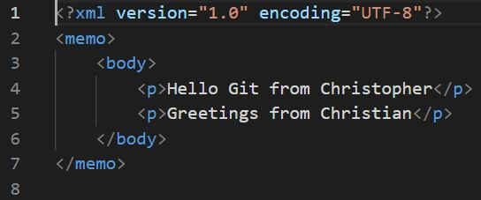

# Table of Contents
 - [Heading 1](#heading-1)
   - [Heading 2](#heading-2)
     - [Heading 3](#heading-3)
   - [Extended Syntax](#extended-syntax)
     - [Tabelle](#tabelle)

# Heading 1

Das ist ein interner Link: [Test](#test)

Text

* item 
* item 
* item

```
<memo>
  <from>Christopher</from>
  <to>Christian</to>
</memo>
```

## Heading 2

### Heading 3

Lorem ipsum dolor sit amet, consetetur sadipscing 
elitr, sed diam nonumy eirmod tempor 
invidunt ut labore et dolore magna aliquyam
erat, sed diam voluptua. 
At vero eos et accusam et justo 
duo dolores et ea rebum. 

Erst eine zusätzliche Zeile macht einen neuen Absatz.

## Ordered List
1. *item 1 is italic*
2. **item 2 is bold**
3. ***item 3*** is italic and bold

Aber auch so: 

1. item 1
1. item 2
3. item 3
2. item 4

### Blockquote 

> some text
>
> some text

### Test

### Links

Das ist ein Link: [text you see](https://de.wikipedia.org/wiki/Markdown)

Das ist ein interner Link: [Spring zu Heading 1](#heading-1)


[](https://codecats.xyz)

## Extended Syntax

### Tabelle

| Packages | Description          | Version |
| :---     |    :----:            |    ---: |
| React    | JavaScript Framework | v18.0   |
| Next.js  | React Framework      | v12.0   |


